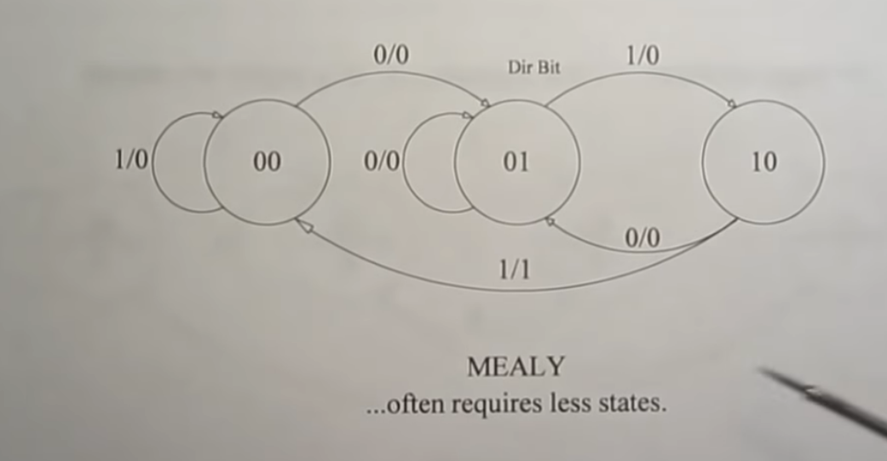

# Find a 011 sequence in a bit stream

For this, we will implement a mealy statemachine as follows:

- Typical characteristic of a mealy statemachine is that, the action and output both are listed on the state transition.
- This means, the output is generated even before the state transition, unlike moore statemachine, where output is generated within the state.
- This particular example is borrowed from YouTube video here: https://www.youtube.com/watch?v=S352lyPZP00&t=261s

## Conventions
- There are three states, "00","01" and "10"
- state transitions are labeled as  < event >/< output >.
  - e.g. in state "00", if event received (i.e. input is 0), transition is made to state "01", and the output generated is 0 (equivalent to false, i.e. 011 is not yet found)
  - on the other hand, if input event was 1, output is still false, but we still remain in state "00", because, no progress has been made towards the expected sequence.

## Implementation
- Start with state "00"
  - In state "00", if input is 0, we now have 0 from 011 -- advance to state "01"
  - In state "01", if input is 1, we now have 01 from 011 -- advance to state "10"
  - In state "10", if input is 1, we now have 011 from 011 -- success, change output to 1, reset to state "00"
  - Plenty of things can go not according to the plan in the meantime, which have been taken care of by relevant transitions.

## Goal
Our goal is to implement this using TinyFSM.  
